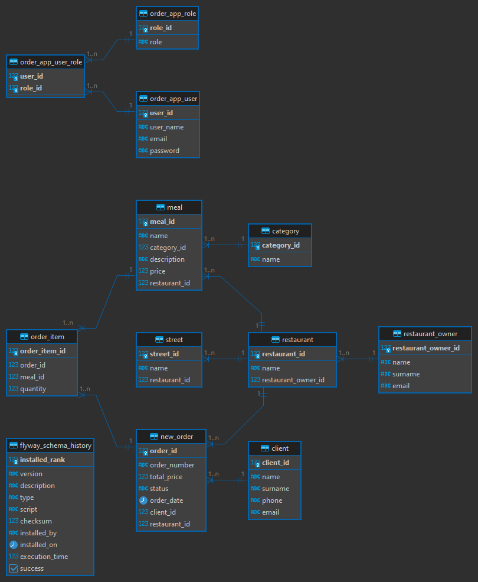

# OrderApp
Online Ordering Application
## Why was this application created ?
The application was developed for the purpose of passing the "Zajavka" bootcamp project.

## Targets
### Who is supplied in this application?
It assumes service to two types of people: the client and the restaurant owner.

### Functionality for restaurant owner
1. Define menus for the restaurants he has previously created.
2. Access to the orders placed by the client at a specific restaurant.
3. Access to the ability to add streets to which he delivers food.

### Functionality for client
1. Find restaurant by street name, which are connected with restaurant (streets define the delivery area)
2. Place an order for selected restaurant
3. Look into orders, which client made in the process
4. Cancel order

### What are my plans for the future ? 
1. Add an ability to delete previously created restaurants 
2. Add an ability to update the order status by restaurant owner
3. Add an ability to cancel order by client in given time
4. Add REST API and SwaggerUI as well  
5. Add tests

## ERD Diagram
Below the ERD Diagram was shown:
