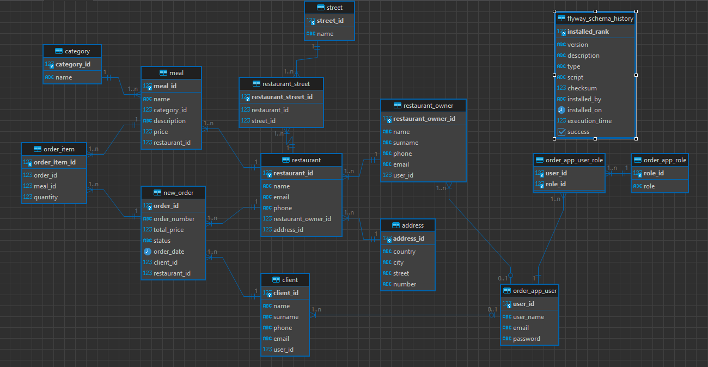

# OrderApp

## Why was this application created and which frameworks/libraries I used for this project?
The application was developed for the purpose of passing the "Zajavka" bootcamp project.
To designed this application I have used: 
- Java 17,
- HTML to prepare views,
- Gradle
- Lombok,
- Spring boot,
- Spring Data JPA,
- Spring Web MVC,
- Tomcat,
- Thymeleaf,
- Spring security (basics),
- PostgreSQL,
- Flyway,
- Mockito.

## Targets
### Who is supplied in this application?
It assumes service to two types of people: the client and the restaurant owner.

### Functionality for restaurant owner
1. Log into the application,
2. Define menus for the restaurants he has previously created,
3. Access to the orders placed by the client at a specific restaurant,
4. Adding restaurant and selecting streets in which delivery will be available,
5. Updating of the order status,
6. Ability to delete previously created restaurants

### Functionality for client
1. Log into the application,
2. Find restaurant by street name, which are connected with restaurant (streets define the delivery area),
3. Place an order for selected restaurant,
4. Look into orders, which client made in the process,
5. Cancel order.

### What are my plans for the future ?
1. Add an ability to cancel order by client in given time,
2. Add REST API and SwaggerUI,
3. Add rest of tests for services and controllers,
4. Add Docker files.

## ERD Diagram
Below the ERD Diagram was shown:
